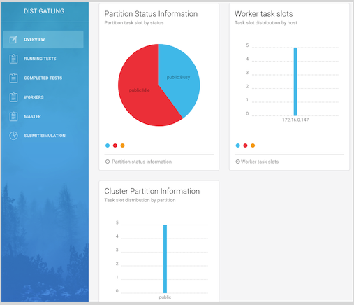
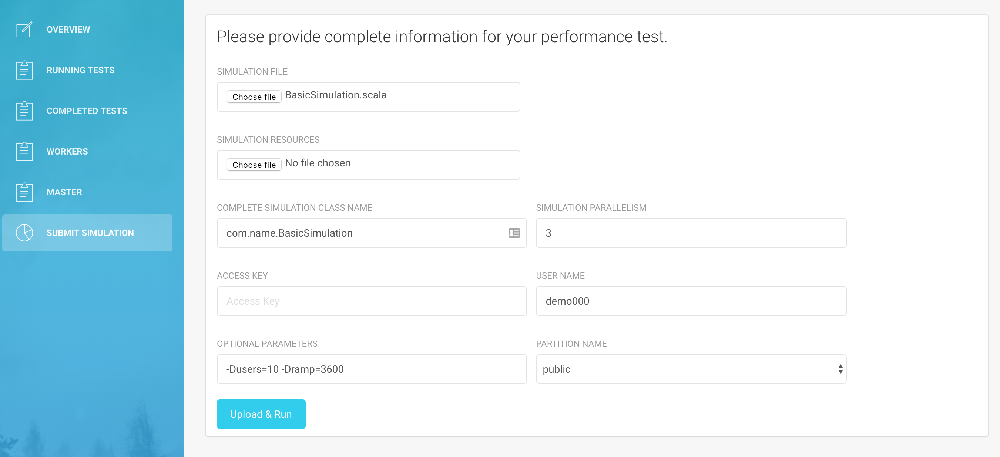
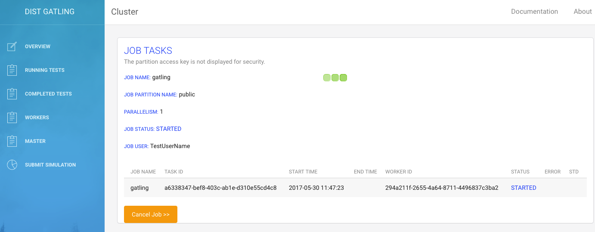
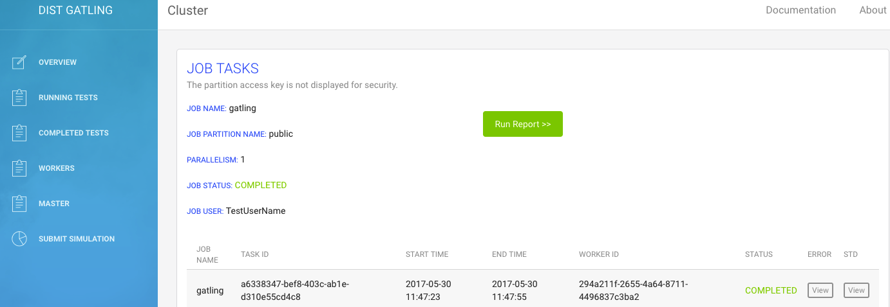
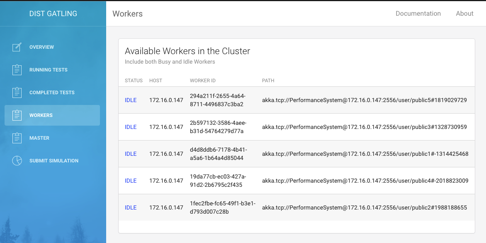

## About Gatling       

[Gatling](https://gatling.io) is a highly capable load testing tool. It is designed for ease of use, maintainability and high performance.

Out of the box, Gatling comes with excellent support of the HTTP protocol that makes it a tool of choice for load testing any HTTP server. As the core engine is actually 
protocol agnostic, it is perfectly possible to implement support for other protocols. For example, Gatling currently also ships JMS support.

The [Quickstart](https://gatling.io/docs/current/quickstart/) has an overview of the most important concepts, walking you through the setup of a simple scenario for load testing an HTTP server.

Having scenarios that are defined in code and are resource efficient are the two requirements that motivated the development of Gatling. Based on an expressive DSL, the scenarios
are self explanatory. They are easy to maintain and can be kept in a version control system.

Gatling’s architecture is asynchronous as long as the underlying protocol, such as HTTP, can be implemented in a non blocking way. 
This kind of architecture lets us implement virtual users as messages instead of dedicated threads, making them very resource cheap. Thus, running thousands of concurrent 
virtual users is not an issue tool. 

## Scaling Out
Sometimes, generating some very heavy load from a single machine might lead to saturating the OS or the network interface controller.

In this case, you might want to use several Gatling instances hosted on multiple machines.

Gatling doesn’t have a cluster mode yet, hence the need for this project.

## Distributed Gatling (DistGatling)

Distributed Gatling is a solution that was created to enable developers and QA engineers to run gatling simulation tests in a distributed/cluster environment.  
The solution is cloud native and has two components, Cluster Master and Cluster Worker.

     The overview section displays information about partition status across the cluster,worker task slots distribution by host and task slot distribution by partition

<!--  -->

---

## Cluster Master (CM)

The Cluster Master  provides users interfaces and REST API's for basic operation related to running , tracking and consolidating performance reports,  Master is also responsible for

    - Handling user request
    - Tracking and monitoring the health of Cluster Workers 
    - Submitting Gatling simulation tasks to distributed workers
    - Tracking the progress of distributed tasks
    - Collecting and Aggregating performance reports
    - Providing a system of records for  multiple simulation history
    - Maintaining repository for simulation and resource files
   
Different projects could share the same cluster and run side by side on the same cluster with  complete isolation

## Cluster Worker(CW)

After joining the cluster, CW workers are responsible for 
    - Running performance tests
    - Pulling Simulation and resource files from the master
    - Proving a streaming REST end points for error logs, std logs and simulation logs
    
## Usage

Download Gatling bundle as a .zip file [here](http://gatling.io/#/resources/download). Unzip the file in a directory of your choosing. Add a cancel.sh command in the bin directory, suitable for your system, that stops the gatling processes on the workers (example:  `ps ax | grep "uploads$1" | grep -v grep | awk '{print $1}' | xargs kill -9` )
                        
After cloning or downloading the repository of distGatling ,use the following steps to start the cluster
    
    1. Update the application.yml file settings (gatling-rest and gatling-agent)
    
    # User account for connect to gatling-rest UI
    security:
        username: "gatling"
        password: "gatling"

    job:
      path: "/workspace/gatling-charts-highcharts-bundle-2.1.7" # Path to the base directory where the gatling lib, simulation, resource and conf are stored
      logDirectory: "/workspace/gatling-charts-highcharts-bundle-2.1.7/" # Base directory for log files(log/error and log/std)
      command: "/bin/bash" # Base command to run gatling.sh file
      artifact: "/workspace/gatling-charts-highcharts-bundle-2.1.7/bin/{0}.sh" # Path for the location of gatling.sh
      jobDirectory: /workspace/gspace/ # directory to store artifacts temporarily, only applicable for agents

    2. Open terminal window and run 
    
     mvn clean package
    
    3. Locate the master shell script(under gatling-rest) and run master.sh to start the Cluster Master, take a note of the master ip and port
        
        /bin/bash master.sh -Dmaster.port=<2551> -Dserver.port=<8080> -DCLUSTER_IP=`hostname -i`
        

After starting the master using the above command, point your browser to GET http://localhost:8080/ to access the web page.

        
    4. Locate the agent shell script(under gatling-agent) and run agent.sh to start the Cluster worker on each node you intend to include in the cluster, each worker should be assigned the correct master contact point
        
        /bin/bash agent.sh -Dakka.contact-points=<MASTER_HOST>:<MASTER_PORT> -Dactor.port=<0> -Dserver.port=<8090>
        
## Usage on Kubernetes

Download Gatling bundle as a .zip file [here](http://gatling.io/#/resources/download). Unzip the file in a directory of your choosing. Add a cancel.sh command in the bin directory, suitable for your system, that stops the gatling processes on the workers (example:  `ps ax | grep "uploads$1" | grep -v grep | awk '{print $1}' | xargs kill -9` )

After cloning or downloading the repository of distGatling ,follow the following steps to start the cluster:

Existing names for every component are:

| Component                             | Name                                            |
|---------------------------------------|-------------------------------------------------|
| kubernetes namespace                  | dist-gatling                                    |
| gatling docker image name             | gatling:3.1.2                                   |
| dist gatling master docker image name | gatling-master:v1                               |
| dist gatling master deployment name   | gatling-master                                  |
| dist gatling mater service name       | gatling-master                                  |
| dist gatling worker docker image name | gatling-worker:v1                               |
| graphite docker image name            | graphite:latest                                 |
| graphite deployment name              | graphite-service                                |
| graphite service host                 | graphite-service.dist-gatling.svc.cluster.local |
| grafana docker image name             | grafana/grafana:latest                          |
| grafana deployment name               | grafana-service                                 |
| role name                             | gatling-role                                    |
| rolebinding name                      | gatling-role-binding                            |
| service account name                  | gatling-service-account                         |

This name can be change according to the next steps:

1.Build a docker image for gatling
* for metrics, enable them from gatling.conf(file can be found in gatling bundle):
```
   data {
       writers = [console, file, graphite]      # The list of DataWriters to which Gatling write simulation data (currently supported : console, file, graphite, jdbc)
       console {
           #light = false                # When set to true, displays a light version without detailed request stats
           #writePeriod = 5              # Write interval, in seconds
       }
       file {
           #bufferSize = 8192            # FileDataWriter's internal data buffer size, in bytes
       }
       leak {
           #noActivityTimeout = 30  # Period, in seconds, for which Gatling may have no activity before considering a leak may be happening
       }
       graphite {
           light = false              # only send the all* stats
           host = "graphite-service.dist-gatling.svc.cluster.local"         # The host where the Carbon server is located
           port = 2003                # The port to which the Carbon server listens to (2003 is default for plaintext, 2004 is default for pickle)
           protocol = "tcp"           # The protocol used to send data to Carbon (currently supported : "tcp", "udp")
           rootPathPrefix = "gatling" # The common prefix of all metrics sent to Graphite
           bufferSize = 8192          # Internal data buffer size, in bytes
           writePeriod = 1            # Write period, in seconds
       }
   }
```

* change host according to the location of your graphite service

* compress gatling bundle folder and name it : gatling-charts-highcharts-bundle.zip

* run Dockerfile-gatling to build the image:
```
   docker buid -t <GATLING_IMAGE_NAME>:<TAG> -f Dockerfile-gatling .
```

2.(OPTIONAL - JUST FOR METRICS) Build and deploy a Graphite image
   * get a graphite docker image
     * option A: get it from [here](https://hub.docker.com/r/graphiteapp/docker-graphite-statsd/)
     * option B: build it from official git repo [here](https://github.com/graphite-project/docker-graphite-statsd)
   * create a deployment with graphite-pod.yaml:
       - change graphite image name according to your built images
       - run: ` kubectl create -f graphite-pod.yaml `
   * expose it as a service

3.(OPTIONAL - JUST FOR METRICS) Build and deploy a Grafana image
   * if you already have a grafana service, this step is not necessary
   * get a grafana docker image [here](https://hub.docker.com/r/grafana/grafana/)
   * create a deployment with grafana-pod.yaml:
       * change grafana image name according to your built images
       * run: `kubectl create -f grafana-pod.yaml`
   * expose it as a service

4.Build dist-gatling
   * before building, go to gatling-rest/src/main/resources/worker-pod.yaml and change image name with 
   ```
   <GATLING_WORKER_DOCKER_IMAGE_NAME>:<TAG>
   ```
   * run: ` mvn clean package `

5.Build docker images for master and workers
* for master :
   * if you build the gatling image with other name, change it on the first line in Dockerfile-master
   * set the following environment variables:

   | Environment variable | Description                                     |
   |----------------------|-------------------------------------------------|
   | GRAPHITE_ENABLE      | true -> enable metrics false -> disable metrics |
   | GRAPHITE_NAME        | name to for graphite deployment                 |

   * change external host in dockerfile after this template : 
   ```
   -DEXTERNAL_HOST=<GATLING_MASTER_SERVICE_MANE>.<KUBERNETES_NAMESPACE>.svc.cluster.local
   ```

* for worker :
   * if you build the gatling image with other name, change it on the first line in Dockerfile-worker
   * set the following environment variables(must have the same values as in Dockerfile-master):

   | Environment variable | Description                                     |
   |----------------------|-------------------------------------------------|
   | GRAPHITE_ENABLE      | true -> enable metrics false -> disable metrics |
   | GRAPHITE_NAME        | name to for graphite deployment                 |

   * set ARG MASTER_SERVER with corresponding value for your master(same as in Dockerfile-master for -DEXTERNAL_HOST)

* For building the images run:

```
   docker build -t <GATLING_MASTER_DOCKER_IMAGE_NAME>:<TAG> -f Dockerfile-master .
   docker build -t <GATLING_WORKER_DOCKER_IMAGE_NAME>:<TAG> -f Dockerfile-worker .
```

6.Set Kubernetes environment:
   * create a namespace with the same name as the environment variables set in Dockerfiles(namespace.yaml can be used):
   
       `kubectl create -f namespace.yaml`
   * create a service account (serviceaccount.yaml can be used):
   
       `kubectl create -f servicesccount.yaml`
   * create a role and a rolebinding (role.yaml and rolebinding.yaml can be used):
       ```
       kubectl create -f role.yaml
       kubectl create -f rolebinding.yaml
       ```
       
7.Create pod for master:
   * in master-pod.yaml change:
       * image name should be <GATLING_MASTER_DOCKER_IMAGE_NAME>:<TAG>
   * for creating the deployment, run:
       `kubectl create -f master-pod.yaml`
       
8.Expose deployment as service

9.Access gatling-master service from your browser

##  Goal

The design of distributed gatling is based on Derek Wyatt's blog on Work pulling pattern and has the following goals:
 
    - Provide a mechanism for the master to detect death of workers and reassign work if need be
    - Dynamic workers to allow for auto scaling, up/down
    - Message that is delivered to Master is durable
    
Multiple teams across your enterprise can share the same cluster, each worker/agent is given a role name via actor.role config property or -Dactor.role parameter. 
When you submit a distributed simulation task you must provide a valid worker role, this allows the system to run the simulation task on the pool of workers labeled with the same role name.
We recommend labeling all your workers with the same name initially and resort to partitioning your workers only when multiple teams start stepping on each other foot. 


Workers pull instructions from the master, the master keeps track of which instruction is consumed by which worker. The instructions could assume one of the following forms:
   
    - FileRequest
    - WorkRequest
    - AbortRequest
    - RegisterRequest
    
The master does not actively assign instructions to any worker but instead workers pull the next task when they are idle. If a worker is busy it will not be issued a new task.
Once the master assigns simulation task to a worker, workers are required to report task progress to master every predefined time interval. 
If the master does not receive a progress heart beat for simulation task, it assumes the worker is dead and reassigns the task to a different worker. 
In addition to marking the worker as dead and the job as failed, the master also removes the worker from the active list of workers. 
If the worker become alive after recovery it should re-join the cluster and re-register with the master.  


## Screen Shots 

---

### Start a distributed simulation task - users provide  the worker pool to use, the simulation file to run and number of parallel tasks

NB: The bodies input wait a zip containing resource files used for your test
<!--  -->
---

### Track the progress of a distributed simulation task on the cluster, after all the distributed tasks complete a button will appear on this page to allow you generate and view the gatling report

<!--  -->

---

### Generate a report  - collects all simulation log and generates a gatling performance report

<!--  -->

---

### Login screen


---

### Cluster information - shows current state of all the workers in the cluster

<!--  -->

### Running a simulation that is packaged into an uber jar is now supported via gatling-client(https://github.com/Abiy/distGatlingClient)

    Update config.yml with the necessary configuration

    Use the following command to submit your uber jar to cluster
    
    /bin/bash dist-gatling-client.sh  -Dclient.userName=user -Dclient.parallelism=1
    
  
      
