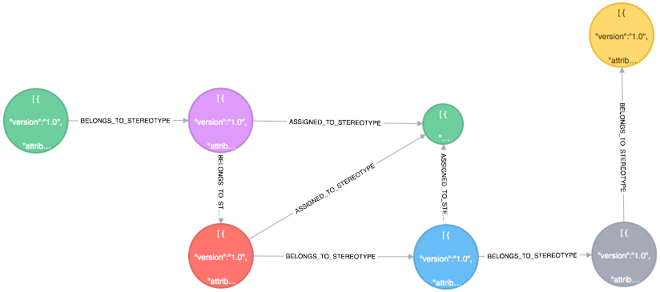

# Enterprise Location Services

A stereotype represents the blue print that dictates how graph artifacts mutate over time , new nodes and relationships are created while still keeping the
graph in a consistent and valid state

**Stereotypes defines:**
  * Specifications for a node and relationship properties 1
  * Specifications for how nodes are inter*connected 2

In neo4j relationships are unidirectional, a cardinality of a relationship defines the minimum and maximum outgoing instance of the same relationship.
Example:----
  * Given  BELONGS_TO relationship between a rack and an aisle 1
  * Can the rack exist 2
    * Without a BELONGS_TO relation to an aisle? This is dictated by minCardinality. 1
    * With multiple instances of outgoing BELONGS_TO relations with multiple aisle? This is controlled by maxCardinality. 2

Markup : 